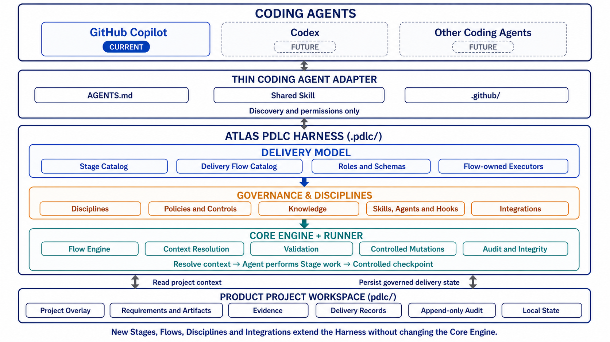

# Atlas PDLC

> Draft for pilot review — August 31, 2026

**Documentation:** [User Guide](ATLAS_PDLC_README.md) · [Architecture](ATLAS_PDLC_ARCHITECTURE.md) · [Maintainers](ATLAS_PDLC_MAINTAINERS.md)

## What is Atlas PDLC?

Atlas PDLC is an extensible **Harness framework for AI-assisted software product delivery**. It provides a stable, platform-neutral foundation that enables coding agents to participate in product delivery through structured, governed, and reusable delivery processes rather than ad hoc prompts and isolated coding tasks.

### Corp AI governance foundation

Atlas PDLC operates within **Corp's established AI-use governance**. The current pilot assumes that the coding agent, account, environment, data handling, security controls, and acceptable-use practices have already been approved through Corp processes. GitHub Copilot is the current Corp-approved Coding Agent for this pilot.

Atlas adds product-delivery governance—Stages, Delivery Flows, Controls, approvals, evidence, and auditability—but it does not replace or weaken Corp requirements. If an Atlas configuration conflicts with a Corp AI, security, privacy, legal, intellectual-property, or data-handling rule, the Corp rule prevails.

### Architecture at a glance



[Open the full-resolution Atlas PDLC architecture diagram](docs/images/atlas-pdlc-architecture.png). The diagram shows GitHub Copilot as the current Coding Agent, future Coding Agent targets, the Thin Coding Agent Adapter, the three internal Harness layers, and the product-owned delivery workspace.

The Atlas PDLC Harness brings together:

- a deterministic **Core Engine** for context resolution, lifecycle control, validation, state management, evidence, and audit;
- a catalog of reusable **PDLC Stages** representing canonical delivery activities such as requirements clarification, solution design, UX design, implementation, verification, and outcome review;
- configurable **Delivery Flows** that compose Stages into purpose-specific delivery lifecycles;
- registered **Disciplines** for Product Management, UX, Solution Architecture, Security, and Data Platform, with an extension model for additional areas such as Engineering and QA;
- reusable **Skills, Agents, and Hooks** that contribute specialized delivery methods at the relevant Stages;
- **Integrations** that provide governed access to external platforms, development tools, enterprise systems, and knowledge sources;
- **Project Overlays** that apply approved project-specific architecture, standards, Policies, Defaults, and Knowledge without forking the shared Harness;
- explicit **Roles, Policies, Controls, approvals, evidence, Delivery Records, and audit history**.

### Configurable delivery for different business needs

Atlas does not impose one universal workflow. Its canonical Stages can be reused and composed into different Delivery Flows based on:

- business objectives and delivery type;
- product and technology context;
- organizational structure;
- risk and regulatory requirements;
- required evidence and approval boundaries;
- external systems and Integrations;
- timebox and governance expectations.

An organization may use a lightweight POC Flow to validate an idea, a Requirements Generation Flow to create delivery-ready Requirements, an Implementation Flow for approved work, or an end-to-end PDLC Flow covering the complete product lifecycle. Organizations can also create their own Delivery Flows, add conditional Stages, introduce specialized Discipline contributions, and define Flow-specific controls without rewriting the Atlas Core Engine.

### Portable through Coding Agent Adapters

Atlas separates the shared Harness from each coding agent through a thin **Coding Agent Adapter** design.

The Harness contains the delivery model, governance rules, Skills, Integrations, state, and deterministic execution logic. A Coding Agent Adapter exposes those capabilities through the discovery, prompt, tool, and permission conventions of a particular coding agent.

GitHub Copilot is the current supported Coding Agent for the Atlas pilot. Codex and other Coding Agents are future Adapter targets. The architecture allows them to use the same Stages, Delivery Flows, Disciplines, Skills, Policies, and Delivery Records without duplicating or modifying the underlying Harness. This separation preserves extensibility and avoids making the delivery framework dependent on one coding agent.

### Clear ownership and governance

Atlas treats ownership as part of the framework rather than informal documentation:

- **Harness Engineering** owns the Core Engine, Runner, schemas, storage, audit, and extension contracts.
- **PDLC Governance** owns canonical Stages, Roles, and shared lifecycle semantics.
- **Delivery Flow Owners** own Stage composition, lifecycle controls, Checkpoints, constraints, and Flow-specific behavior.
- **Discipline Owners** own their professional Artifacts, Policies, Knowledge, Skills, Agents, Hooks, and approval boundaries.
- **Integration Owners** own external-system permissions, credential boundaries, applicability, and bundled Skills.
- **Project Governance** owns approved Project Baselines, additional Policies, Defaults, and local Knowledge.

This model allows Product, UX, Architecture, Security, Engineering, QA, and platform teams to maintain their own expertise while participating in a shared delivery lifecycle.

### Core value

Atlas PDLC turns AI-assisted delivery from an ad hoc coding interaction into a **repeatable, configurable, governed, and auditable product delivery capability**.

It combines the flexibility of conversational AI, the consistency of reusable delivery processes, the expertise of professional Disciplines, the safety of explicit controls and approvals, the portability of a platform-neutral Harness, and the extensibility required to support different businesses, technologies, and coding agents.

Atlas does not replace Product, Engineering, or QA judgment. It coordinates their responsibilities and prevents an agent from silently moving from an idea to implementation without an approved delivery contract.

## Who this guide is for

Use this guide if you want to:

- install Atlas PDLC in a product repository;
- run a controlled proof of concept with GitHub Copilot;
- understand what a user must review and approve;
- operate an Atlas pilot safely.

For the underlying model, read [Atlas PDLC Architecture](ATLAS_PDLC_ARCHITECTURE.md). To add or change Stages, Delivery Flows, Disciplines, Policies, or Integrations, read [Atlas PDLC Maintainers](ATLAS_PDLC_MAINTAINERS.md).

## Delivery Flows

A **Delivery Flow** is an ordered composition of reusable delivery Stages plus the controls needed to run that lifecycle. A Flow can define:

- required and conditional Stages;
- lifecycle states and terminal outcomes;
- approval Checkpoints and their owning Roles;
- delivery constraints and defaults;
- optional Flow-specific deterministic behavior.

Atlas is not limited to one fixed workflow. Organizations can create Delivery Flows for different delivery purposes while continuing to reuse the same Stage Catalog, Disciplines, governance assets, Runner, and audit model.

### Pilot availability and roadmap

Only the **POC Delivery Flow** is currently ready for pilot use. Other Flows are under development and must not be presented or used as ready capabilities. Technical definitions or partial runtime behavior in the repository support engineering and testing; they do not by themselves establish Pilot Ready status.

| Delivery Flow | Status | Purpose |
|---|---|---|
| POC | **Ready** | Validate a bounded idea through approved Requirements, implementation, evidence, and a final disposition. |
| Product Requirements Analysis | Developing — target week of August 31, 2026 | Turn an approved product requirement into versioned Story snapshots and an approved Sprint Scope. |
| Implementation | Developing — target week of August 31, 2026 | Deliver from approved Requirements or Stories through implementation, verification, sign-off, and release integration. |
| End-to-End PDLC | Developing — target week of September 7, 2026 | Coordinate delivery from an initial idea through implementation, release, and outcome review. |
| Custom Flow | Extension capability | Let an organization implement and register a Flow that composes canonical Stages and Flow-owned controls for an approved delivery purpose. |

The target weeks are planning targets, not behavior guaranteed by the Harness. A developing Flow becomes Ready only after its controls, runtime behavior, tests, documentation, Coding Agent Adapter entry points, and owner approvals are complete. Developing Flows must not perform JIRA or XRAY writes or production delivery.

Detailed Flow extension procedures are in [Atlas PDLC Maintainers](ATLAS_PDLC_MAINTAINERS.md#add-a-delivery-flow).

## What the POC Flow does

The POC Flow is a non-production path for answering a bounded product or technical question.

```text
Idea
  -> Requirements clarification
  -> Lightweight solution and conditional UX design
  -> Build Readiness review and approval
  -> Implementation
  -> Developer, conditional security, and acceptance verification
  -> Park or recommend productization
```

### POC Stages

| # | Stage | Applies when | Purpose |
|---:|---|---|---|
| 1 | Requirements Clarification | Always | Clarify users, behavior, scenarios, scope, data, safety boundaries, and success measures. |
| 2 | Solution Design | Always | Define the smallest reversible solution and verification approach. |
| 3 | UX Design | The POC includes a web or mobile UI | Define user journeys, interaction states, accessibility, and failure behavior. |
| 4 | Build Readiness | Always | Reconcile Requirements, design, Controls, project context, risks, and the proposed implementation. |
| 5 | Requirements Approval | Always | Present the complete Requirements contract for explicit Product approval. |
| 6 | Implementation | Always | Implement only the approved POC scope. |
| 7 | Developer Verification | Always | Run developer tests and capture build and technical evidence. |
| 8 | Security Verification | A security risk is activated | Verify sensitive-data, credential, external-access, or regulatory Controls and evidence. |
| 9 | Acceptance Verification | Always | Demonstrate the approved behavior and evaluate acceptance evidence. |
| 10 | Outcome Review and Disposition | Always | Decide whether to park the POC or recommend it for productization. |

Not every Stage requires a separate user approval. The Agent performs routine Stage work conversationally. Explicit confirmation is required only at declared controlled transitions and other applicable governance boundaries.

### Controlled transitions

The Flow has three controlled transitions:

| Transition | Meaning | Required confirmation |
|---|---|---|
| Commit | Requirements and Build Readiness are approved; implementation may begin. | Product approval |
| Verify | Required test, build, demo, and conditional security evidence has been reviewed. | QA approval |
| Decide | The validated POC is parked or recommended as input to a formal delivery process. | Product approval |

`PRODUCTIZATION_RECOMMENDED` is not production approval. It produces a reviewed package of Requirements, evidence, known gaps, Controls, and reuse decisions for a later formal Delivery Flow.

## Install Atlas PDLC

### Prerequisites

The project installer needs:

- Git;
- [Bun](https://bun.sh/docs/installation) 1.0 or newer;
- a supported GitHub Copilot environment for the current pilot;
- a non-production project workspace for the pilot.

Routine POC users do not run Bun or the Atlas Runner themselves. Bun is the deterministic runtime used by the installer, maintainer, and AI agent.

### Install Bun on Windows

The current pilot installation instructions target Windows 10 version 1809 or later. Open PowerShell and use the Corp-approved Bun distribution method. If Corp permits the official Bun installer, run:

```powershell
powershell -c "irm bun.sh/install.ps1|iex"
```

Then open a new terminal and verify the installation:

```sh
bun --version
```

If Corp does not permit shell-piped installers, use the approved internal package or software-distribution channel instead. Refer to the [official Bun installation page](https://bun.sh/docs/installation) for current Windows requirements and troubleshooting.

### Start from the Atlas repository

During the v2 pilot, clone the supported branch explicitly. The repository URL below is a placeholder and must be replaced with the final Corp GitHub URL before publication:

```sh
git clone --branch v2 --single-branch https://github.com/CORP_ORG/atlas-pdlc.git atlas-pdlc
cd atlas-pdlc
bun install --cwd .pdlc
```

### Add Atlas to an existing product repository

Copy these paths while preserving their repository-relative locations:

```text
AGENTS.md
.agents/skills/lean-pdlc/
.github/copilot-instructions.md
.github/agents/lean-pdlc.agent.md
.github/prompts/pdlc.prompt.md
.github/workflows/copilot-setup-steps.yml
.pdlc/
pdlc/
ATLAS_PDLC_README.md
ATLAS_PDLC_ARCHITECTURE.md
ATLAS_PDLC_MAINTAINERS.md
```

Atlas keeps its package manifest, lockfile, TypeScript configuration, definitions, and Runner inside `.pdlc/`. It does not replace the adopting product's root `package.json`, lockfile, `tsconfig.json`, or `README.md`.

The product-owned `pdlc/` directory contains project configuration, Requirements, evidence, artifacts, Delivery Records, and audit history. The ignored `pdlc/.state/` directory contains transient inbox drafts, the current-record pointer, and locks.

### Verify the installation

An installer or Atlas maintainer runs:

```sh
bun install --cwd .pdlc
bun run --cwd .pdlc typecheck
bun run --cwd .pdlc test
bun .pdlc/cli.ts validate
```

A successful installation passes type checking, the Harness test suite, schema and reference validation, Flow registration checks, and Coding Agent Adapter checks.

## Start a POC

Open the product repository in a supported GitHub Copilot surface and describe the hypothesis or outcome you want to validate.

Preferred conversational entry point:

```text
/pdlc poc validate whether support agents can classify customer feedback into billing, access, and product-bug categories.
```

Natural language is also valid:

```text
Use Atlas PDLC to start a POC that validates whether support agents can classify customer feedback.
```

Atlas v2 retains some compatibility identifiers such as the `lean-pdlc` Skill directory and Agent filename. Depending on the Coding Agent Adapter version, the Agent picker may temporarily display **Lean PDLC**. These identifiers refer to the Atlas PDLC Harness and should not be renamed without a coordinated compatibility migration.

## Work through the POC

### 1. Clarify Requirements

Atlas creates a Draft Delivery Record and a Requirements shell, then asks focused product questions. The Agent should ask no more than three unresolved questions in one round and offer selectable answers when choices help the user decide.

Atlas must clarify the user, problem, behavior, business rules, scenarios, scope, data decisions, safety boundaries, and success measures. It must not invent missing product decisions.

### 2. Review Build Readiness

Before product code is created or application dependencies are installed, Atlas presents the complete Requirements and a Build Readiness summary covering:

- intended behavior and user scenarios;
- scope, exclusions, and edge cases;
- UX and failure behavior where applicable;
- quality, data, privacy, and safety requirements;
- success measures and verification approach;
- applicable Controls, Project Baselines, Defaults, Knowledge, and exceptions;
- the proposed implementation.

The user explicitly approves the named Requirements document and Build Readiness summary. Atlas then performs the controlled Commit transition. Material changes to the approved contract require a revised review and approval.

### 3. Implement the approved scope

The Agent implements only the approved POC scope. It may run ordinary project tests, builds, and local verification after Build Readiness. Atlas Runner operations remain separate from application commands.

### 4. Verify evidence

Atlas collects references to test, build, demo, and conditionally required security evidence. Before Verify, it checks that:

- the approved Requirements content has not changed silently;
- required evidence is present;
- local evidence is a readable regular file inside the project workspace;
- URL or CI evidence uses a valid HTTP or HTTPS reference;
- required Stage Context applications remain current;
- applicable Controls are satisfied or formally excepted.

### 5. Decide the outcome

After Verify, Product chooses:

- **Park** — preserve the POC, Requirements, implementation, and evidence for possible later work.
- **Recommend productization** — create and approve a Productization Package for a subsequent formal Delivery Flow.

The POC Flow never deploys to production and never performs JIRA or XRAY writes.

## Status, audit, and resume

Use conversational requests rather than invoking the Runner directly:

```text
/pdlc status
/pdlc audit
/pdlc audit <record-id>
/pdlc resume <record-id>
/pdlc help
```

Status reports the active Flow, current Stage and state, available next actions, blockers, Requirements approval, evidence readiness, and applied context. Audit reports the append-only lifecycle timeline and its supporting evidence. Status and audit are read-only.

`status`, `audit`, and `resume` are canonical shared-Skill intents rather than Runner commands. The current GitHub Copilot `/pdlc` prompt explicitly advertises `poc`, `resume`, `status`, and `help`; `audit` and `product-requirements-analysis` require a Coding Agent Adapter surface that forwards those intents to the shared Skill, or an equivalent natural-language request.

`resume <record-id>` tells the Agent to target an existing Record for the resumed work. The current Runner does not expose a persistent record-selection command, so resume must not be interpreted as changing the checkout's `pdlc/.state/current` pointer.

One workspace may retain multiple completed Delivery Records, but a checkout may have at most one active Record. Use a separate workspace when two POCs must proceed concurrently.

## Pilot boundaries

Use the current Atlas POC pilot only when all of the following are true:

- the work is bounded and non-production;
- production deployment is out of scope;
- no real credentials are stored in the repository or Delivery Record;
- regulated or sensitive production data is not used;
- external JIRA, XRAY, release, and production writes are not required;
- a human can review Requirements, evidence, and final disposition;
- the team accepts that Pilot support may require Atlas maintainer intervention.

Recommended first pilot cases include a local automation, a small web-interface experiment, and a low-risk security-aware case using synthetic data.

## Troubleshooting

### Bun is not found

Open a new terminal after installation, run `bun --version`, and confirm the Bun binary directory is on `PATH`. Use the official Bun installation guide or your organization's approved package distribution.

### Atlas is not discovered by the Agent platform

Confirm that `AGENTS.md`, `.agents/skills/lean-pdlc/SKILL.md`, and the relevant `.github/` Coding Agent Adapter files exist at their expected repository-relative paths. Restart or reopen the repository after copying the files.

### Validation fails

Read the exact validation code and path reported by the Agent. Do not bypass unknown Stage references, stale Context Receipts, invalid Project Overlays, missing Role assignments, or locked-Control conflicts.

### Another active Delivery Record exists

Resume and complete or park the active delivery, or use a separate workspace. Do not delete the current pointer or edit a Record status to imitate completion.

### Build Readiness or Verify is blocked

Ask Atlas for status. It will report missing Requirements decisions, stale context, unresolved Controls, approval gaps, or missing evidence. Correct the source issue and rerun the controlled check; do not edit audit state manually.

## Learn more

- [Atlas PDLC Architecture](ATLAS_PDLC_ARCHITECTURE.md) explains the model, trust boundaries, Control chain, Flow Engine, and delivery state.
- [Atlas PDLC Maintainers](ATLAS_PDLC_MAINTAINERS.md) explains how to add and govern Stages, Delivery Flows, Disciplines, Integrations, and project configuration.
